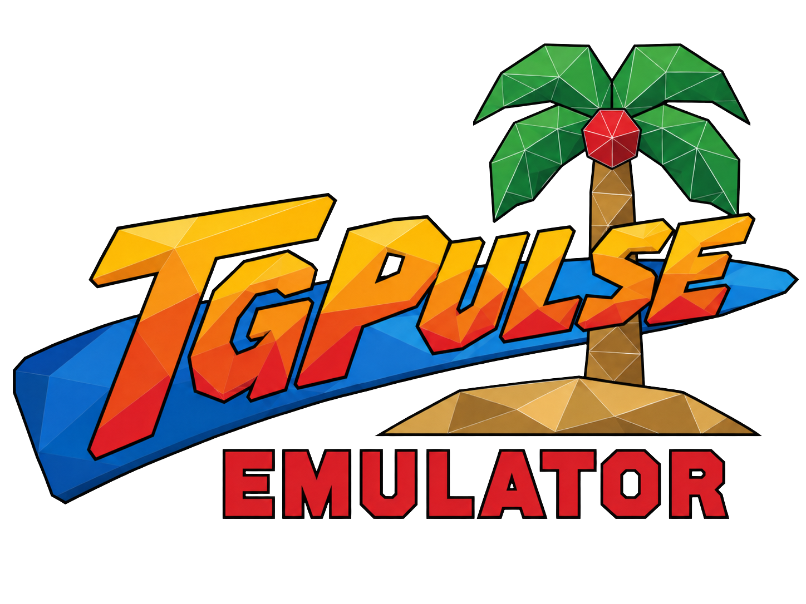

# 

Emulator for Sega's Model 1 and Model 2 arcade boards, written in Rust.
Currently with Linux, Windows and Android builds (Android branch.)

Every processor is emulated at instruction level: the NEC V60 and MB86233 "TGP"
on the Model 1; the Intel i960, the TGP, the ADSP-21062 SHARC and the MB86235
"TGPx4" across the Model 2 revisions. No dump of the geometry engine exists, so
its display-list stream is decoded behaviourally, as MAME's is. Pixel coverage
is a hardware model in a compute shader rather than a modern rasterizer, so
dither patterns and other artefacts are reproduced.

## Running

```sh
cargo build --release
mkdir -p roms && cp ~/wherever/vf2.zip roms/
./target/release/tgpulse
```

**ROMs.** One zip per set in `roms/`, or `--roms <dir>`. Use the standard
zipped chip dumps; do not unzip them or rename their contents. Archive names
are ignored, since sets are identified by matching contents against the ROM
database. None are included here; you need the rights to the data.

**Launching.** With no arguments, the library window lists the sets found in
`roms/`, identifies them, and reports anything missing. Double-click to run;
Refresh after adding archives.

```sh
./target/release/tgpulse vf2        # by set name
./target/release/tgpulse --list     # list roms/, no window
./target/release/tgpulse --help     # all options
```

**Controls.** Coin `5` (Select), start `Enter` (Start), movement on the arrow
keys, WASD, d-pad or left stick, actions `J`/`K`/`L` and West/South/East.
Driving games steer left and right and use the triggers for throttle and brake;
gun games aim with the mouse and fire with `Space`. All rebindable under
Settings -> Input, saved to `config/input.conf`. Test menu `F2`, service switch
`F8`.

| Key | |
| --- | --- |
| `F1` | show or hide the interface over a running game |
| `F3` | reset the machine |
| `F5` / `F7` | save and load the current state slot |
| `F4` / `F6` | previous and next slot |
| `F9` | pause |
| `F11` | fullscreen |
| `Tab` | fast forward while held |

**Files written.** Battery-backed RAM (high scores, rankings, test menu
settings) to `nvram/<set>.nv` on close, reloaded on the next run. Save states to
`states/`, options and bindings to `config/`. Nothing is written elsewhere.

## Rendering

Native output is 496x384 with no antialiasing. The rasterizer is reproduced
exactly, including dither patterns, stipple transparency and painter-sort
artefacts.

- `--ssaa 1..4` (default 2) supersamples the 3D layer and presents it at twice
  board resolution; tile layers (HUD, text, sky) scale by integer factors.
  `--ssaa 1` is the board's output pixel for pixel.
- `--widescreen on` renders 16:9 by widening the frustum and viewport around
  the centre rather than stretching. Not hardware behaviour: games composed for
  4:3 may show edge-pinned HUD elements and scenery ending where the original
  camera stopped. 2D layers stretch to fill unless `--widescreen-stretch-2d
  off`.
- `--smooth-shadows off` reproduces the board's lack of an alpha channel:
  checkerboard-stipple shadows and thresholded per-texel coverage on
  translucent textures. The default blends them.

## Status

The ROM database covers 100 sets, but an entry only means the memory image can
be built, not that the game runs. Twelve are tested: they boot, play, and
render frames checked against MAME. The rest may do anything from black-screen
to subtly wrong.

| Board | Tested |
| --- | --- |
| Model 1 | Virtua Racing, Virtua Fighter, Star Wars Arcade |
| Model 2 | Daytona USA (and Special Edition), Virtua Cop |
| Model 2A | Sega Rally Championship, Virtua Fighter 2 |
| Model 2B | Virtua Striker, Sonic Championship |
| Model 2C | The House of the Dead, Wave Runner |

**No multiplayer.** M2COMM is modelled only as far as one cabinet needs: the
ring closes on itself so the network check passes. Twin Daytona and Virtua
Striker's versus play run as a single machine.

## Roadmap

- **More games.** New sets tend to expose real bugs: Virtua Fighter 2's hair
  was an i960 burst-read bug, Wave Runner's failure to boot a missing EEPROM.
- **Multiplayer.** Link two instances over a socket, as MAME's `m2comm` does.
- **Model 1 save states.** Snapshots cover Model 2 only; Model 1 games save
  NVRAM but not machine state.
- **Encrypted sets.** The 315-5881 implementation is in the tree but unused, so
  Dynamite Cop, Zero Gunner and the rest do not run.
- **`model1io2`.** Not emulated, so Wing War and Sega NetMerc are left out of
  the database's I/O firmware wiring.
- **Virtua Racing region.** Read from EEPROM, boots English; test menu changes
  do not persist because the game never writes the chip back. Needs a firmware
  trace to establish whether hardware does the same.

## Layout

```
crates/i960        Intel i960KB              -- Model 2 main CPU
crates/v60         NEC V60                   -- Model 1 main CPU
crates/mb86233     Fujitsu MB86233 "TGP"     -- Model 1 and 2/2A geometry
crates/mb86235     Fujitsu MB86235 "TGPx4"   -- Model 2C geometry
crates/sharc       Analog Devices ADSP-21062 -- Model 2B geometry
crates/sega-crypt  Sega 315-5881 decryption
crates/tgpulse-core  the machine: memory maps, geometry, sound, save states
crates/tgpulse       the front end: window, renderer, interface, input, audio
tools/               the ROM database generator and a MAME comparison harness
```

`tgpulse-core` has no window, GPU or controller: a front end drives it a frame
at a time and reads back the framebuffer, so the debugger and the comparison
harness can run it headlessly.

## Accuracy

MAME is the reference. Memory maps follow its ordering so the two can be read
side by side, and divergences are found by diffing instruction traces, work RAM
and rendered frames (`tools/mamediff.sh`).

The debugger is script-driven and the machine deterministic, so investigations
replay exactly:

```sh
./target/release/tgpulse vf2 --debug -c "run 1400; geo; vertices"
```

Output is one `kind key=value` line at a time, and every command reports what
it did.

## Building

A Cargo workspace with no vendored dependencies. A stable toolchain from
[rustup](https://rustup.rs) is enough; the binary lands in
`target/release/tgpulse`.

**Linux.**

```sh
sudo apt install build-essential libudev-dev libasound2-dev   # Debian, Ubuntu
sudo pacman -S base-devel systemd-libs alsa-lib               # Arch
sudo dnf install gcc systemd-devel alsa-lib-devel             # Fedora

cargo build --release
```

`libudev` is for gamepad detection, ALSA for audio. Rendering uses Vulkan where
the driver offers it and GL otherwise.

**Windows.** Native builds need the MSVC toolchain and Visual Studio's C++
build tools, then `cargo build --release`. Cross-compiling from Linux needs
only the target and mingw, the linker already being named in
`.cargo/config.toml`:

```sh
rustup target add x86_64-pc-windows-gnu
sudo apt install mingw-w64          # or: pacman -S mingw-w64-gcc
cargo build --release --target x86_64-pc-windows-gnu
```

The result is `target/x86_64-pc-windows-gnu/release/tgpulse.exe`, which wants
the same `roms/` directory beside it.

**Tests.** `cargo test --release`. The processor tests assemble their own
programs and need no ROM data.

Android is packaged with `cargo-apk` and covered in
[docs/BUILDING.md](docs/BUILDING.md); it has not been run on a device.

## Thanks

**The MAME project** — public documentation of these boards, down to chip
identification, bus wiring and undocumented registers, is what makes an
independent implementation practical, and is the reference used here.

**ElSemi** — Nebula Model 2 established much of the current understanding of
the geometry pipeline and rasterizer, and widescreen mode follows it.

Neither is affiliated with this project. Any inaccuracy is this program's own.

## License

MIT, in [LICENSE](LICENSE). ROM images are copyrighted by their publishers and
none are included here.

## Logging

Off by default, addressable per subsystem:

```sh
RUST_LOG=info ./target/release/tgpulse vf2
RUST_LOG=warn,geo=trace ./target/release/tgpulse vf2
```

Targets include `geo`, `fifo`, `io`, `sound`, `copro`, `nvram`, `backup`,
`comm`, `library` and `video`.
